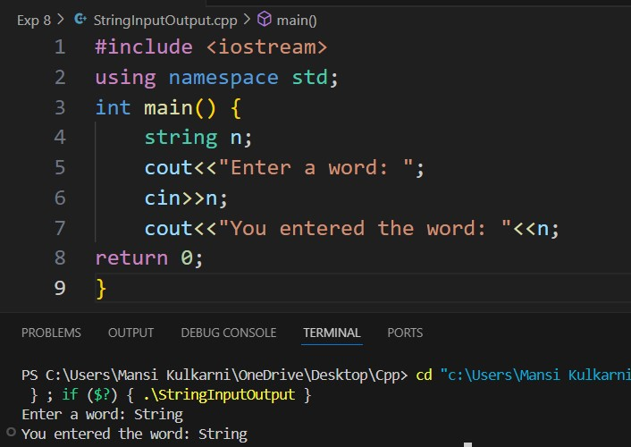
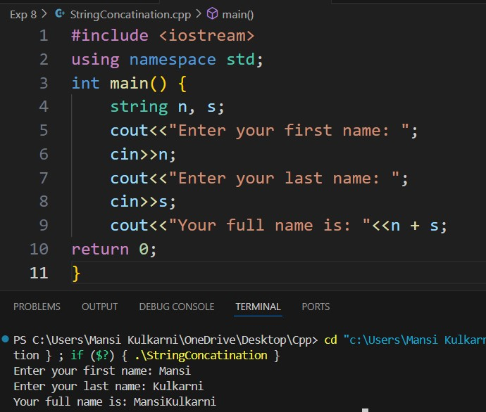
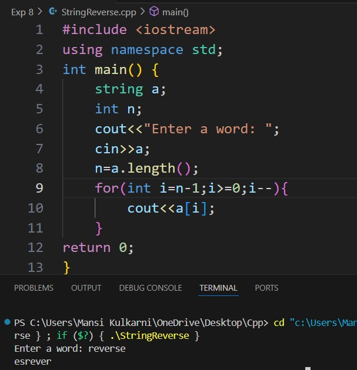
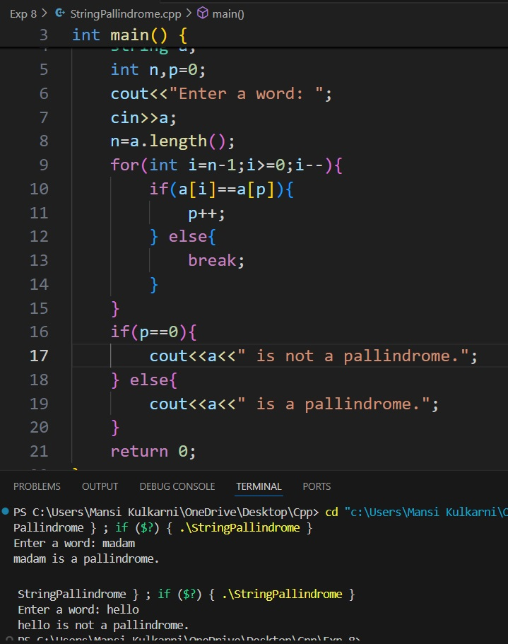
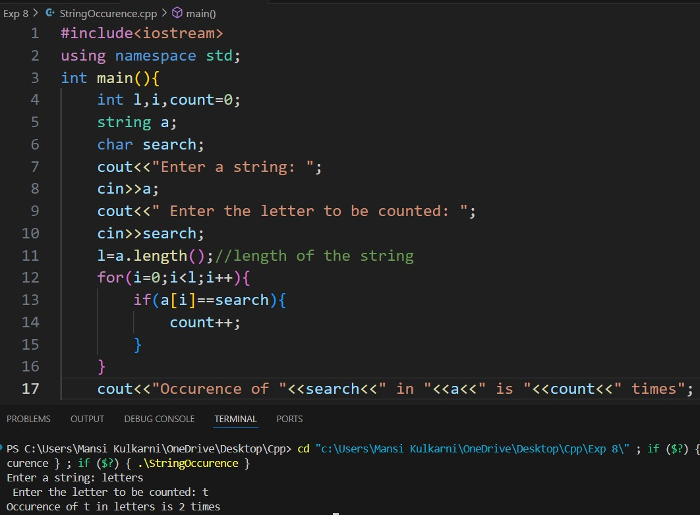

# Experiment 8
## Program 1
### Aim: 
Take string input from user and print it.
### Software used: 
Visual Studio Code
### Theory:
A string in C++ is a sequence of characters. It is commonly used to store and manipulate text. C++ provides two ways to work with strings: using C-style strings (which are arrays of characters ending with a null terminator \0) or using the std::string class from the Standard Template Library (STL). The std::string class provides numerous functions to work with strings, including length calculation, concatenation, comparison, and substring extraction. Strings are essential in many applications such as user input handling, text processing, and file manipulation.
### Output:

### Conclusion:
We learned how to take string input from user and display it. 

## Program 2
### Aim: 
Take two strings from user and concatenate those.
### Software used: 
Visual Studio Code
### Theory:
String concatenation is the process of joining two or more strings together to form a single string. In C++, the + operator or the append() function can be used to concatenate strings. This operation is frequently used in constructing output messages, formatting data, or combining multiple pieces of text into a single string.
### Output:

### Conclusion:
We learned how to concatenate a string. 

## Program 3
### Aim: 
Take a string from user and reverse it.
### Software used: 
Visual Studio Code
### Theory:
Reversing a string involves rearranging the characters in the string so that they appear in the reverse order. 
### Output:

### Conclusion:
We learned how to reverse a string. 

## Program 4
### Aim: 
Check whether the string entered by the user is palindrome
### Software used: 
Visual Studio Code
### Theory:
A string is considered a palindrome if it reads the same backward as forward. For example, if a string remains unchanged when reversed, it is identified as a palindrome. Checking for a palindrome typically involves comparing characters from the beginning and end of the string and moving toward the center. Palindromes are widely studied in algorithms, text processing, and pattern recognition.
### Output:

### Conclusion:
We learned how to check if a string is a palindrome. 

## Program 5
### Aim: 
Count the number of occurrences of a letter in the given string
### Software used: 
Visual Studio Code
### Theory:
Finding the occurrence of an element (or character) in a string involves scanning through the string and counting how many times a specific character or substring appears. This operation is useful in text analysis, searching algorithms, and frequency analysis. 
### Output:

### Conclusion:
We checked occurances of an element in a string. 
